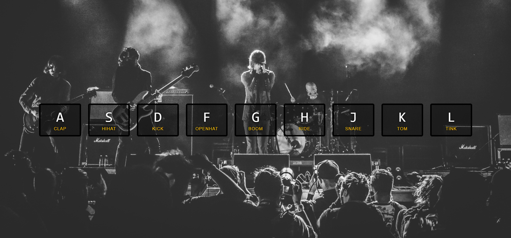

## VanillaJS 30 Challenge!

JavaScript30 or vanillaJS30 challenge is a 30 days long challenge packed with different 30 challenges or tasks to practice and understand the fundamentals of JavaScript by applying vanilla javascript in every task. You can complete this task early as well because it hooks you from the moment you start doing it.

Personally I've got to know about :

- Using Arrays as storage as logic and applying methods to fetch some particular data in accordance with requirement.
- Using event listeners in different ways.
- Applying logic with adding and removing class list in different scenarios making the css more user dynamic and responsive.
- About Event Capture, propagation, bubbling, etc.
- Using speechrecognition to complete tasks like speech synthesis and speech recognitions system.
- Adding different transitions with javascript functionalities to add dynamics to the website as user get along.
- using media devices while creating a task related to using webcam and adding different filters and effect.

and so many other things as well!

I highly encourage this exercise to someone who is a beginner in javascript and knows the fundamental but want to explore on how you do you use JavaScript to make your site more dynamic and responsive.

## Some tasks from the above challenge.

### Whac-a-mole Game

### Drumkit

 

### Videoplayer

